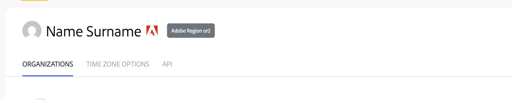

# API Request Headers

All API requests must be sent to `fusion.adobe.io` with the required headers described below. These headers are used for request validation, authentication, and routing to the correct Fusion instance.

## Required Headers

### x-gw-region

**Purpose:** Routes requests to the correct Fusion region.

**Description:** The Fusion platform requires requests to be directed to the appropriate regional instance. To find your organization's region identifier:

1. Log in to Fusion as any user
2. Click on your profile icon in right corner, then visit Fusion Profile
3. Locate the **Adobe region** identifier next to your username (e.g., `or2`)
4. Use this value in the `x-gw-region` header

**Example:** If your region identifier is `or2`, set the header value as `or2`
This header is required for proper request routing.

### x-api-key

**Purpose:** Identifies your application using the Client ID.

**Description:** This value corresponds to the **Client ID** from your Adobe Developer Console project credentials. The Client ID is generated when you create your integration and is the same value used for IMS authentication.

**Where to find:** Developer Console > Your Project > Credentials > Client ID

See the [Authentication guide](../credentials/) for detailed instructions on obtaining your Client ID.

### x-gw-ims-org-id

**Purpose:** Identifies your IMS organization.

**Description:** The IMS Organization ID validates that the Fusion product is provisioned for your organization and that the user or technical account in the Authorization header has appropriate access.

**Where to find:** Developer Console > Your Project > Credentials > Organization ID

### Authorization

**Purpose:** Authenticates the user or technical account making the request.

**Description:** This header must contain a valid IMS access token for a user or technical account with appropriate Fusion permissions.

**Format:**
```
Authorization: Bearer {access_token}
```

See the [Authentication guide](../credentials/) for detailed instructions on obtaining access tokens.

## Common Error Responses

When required headers are missing or invalid, the API returns the following errors:

### Missing API Key
```json
{
  "error_code": "403000",
  "message": "Api Key is required"
}
```
**Cause:** The `x-api-key` header was not provided.

### Invalid API Key
```json
{
  "error_code": "403003",
  "message": "Api Key is invalid"
}
```
**Cause:** The provided API key does not match a valid Developer Console Client ID with Fusion API access.

### Invalid OAuth Token
```json
{
  "error_code": "401013",
  "message": "Oauth token is not valid"
}
```
**Cause:** The token in the Authorization header is expired or invalid.

### Missing Required Header
```json
{
  "error_code": "400003",
  "message": "Missing header"
}
```
**Cause:** A required header (such as `x-gw-region`) was not provided in the request. 
