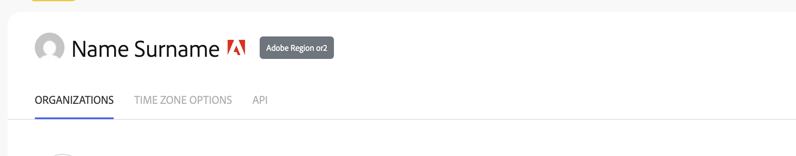

# API Headers

All API requests must be sent to `fusion.adobe.io` with the required headers described below. These headers are used for request validation, authentication, and routing to the correct Fusion instance.

## Required Headers

### x-gw-region

**Purpose:** Routes requests to the correct Fusion region.

**Description:** The Fusion platform requires requests to be directed to the appropriate regional instance. To find your organization's region identifier, use one of the following methods.

**Option 1: Users regions endpoint**

Call `GET /api/v3/users/me/regions` with your `Authorization` header. It reads your IMS profile and returns one `{ region, organizationId }` entry per Fusion organization you can access, so you know which `x-gw-region` and `x-organization-id` to send on subsequent requests.

Call this endpoint against `app.workfrontfusion.com`, not `fusion.adobe.io` — `fusion.adobe.io` requires the `x-gw-region` header, which you don't have yet.

```shell
curl --location 'https://app.workfrontfusion.com/api/v3/users/me/regions' \
--header 'Authorization: Bearer yourAccessToken'
```

The response will look like this:

```json
[
  {
    "region": "or2",
    "organizationId": 2332
  }
]
```

**Option 2: Fusion Profile page**

1. Log in to Fusion as any user.
2. Click on your profile icon in right corner, then visit Fusion Profile.
3. Locate the **Adobe region** identifier next to your username (e.g., `or2`).
4. Use this value in the `x-gw-region` header.


**Example:** If your region identifier is `or2`, set the header value as `or2`.
This header is required for proper request routing.

### x-api-key

**Purpose:** Identifies your application using the Client ID.

**Description:** This value corresponds to the **Client ID** from your Adobe Developer Console project credentials. The Client ID is generated when you create your integration and is the same value used for IMS authentication.

**Where to find:** Developer Console > Your Project > Credentials > Client ID

See the [Authentication guide](../credentials/index.md) for detailed instructions on obtaining your Client ID.

### x-organization-id

**Purpose:** Identifies your Fusion organization and is a number.

**Description:** Scopes all requests to a specific Fusion organization ID for security reasons and validates that the user belongs to that organization when requesting data.

**Where to find:** Visit the org overview page of the organization you want to work with. In the routing, locate the organization ID: `.../organization/{{organizationId}}/dashboard`. Set this once in your scripts and bind all requests with this identifier.

### Authorization

**Purpose:** Authenticates the user or technical account making the request.

**Description:** This header must contain a valid IMS access token for a user or technical account with appropriate Fusion permissions.

**Format:**
```
Authorization: Bearer {access_token}
```

See the [Authentication guide](../credentials/index.md) for detailed instructions on obtaining access tokens.

## Common Error Responses

When required headers are missing or invalid, the API returns the following errors:

### Missing API Key
```json
{
  "error_code": "403000",
  "message": "Api Key is required"
}
```
**Cause:** The `x-api-key` header was not provided.

### Invalid API Key
```json
{
  "error_code": "403003",
  "message": "Api Key is invalid"
}
```
**Cause:** The provided API key does not match a valid Developer Console Client ID with Fusion API access.

### Invalid OAuth Token
```json
{
  "error_code": "401013",
  "message": "Oauth token is not valid"
}
```
**Cause:** The token in the Authorization header is expired or invalid.

### Missing Required Header
```json
{
  "error_code": "400003",
  "message": "Missing header"
}
```
**Cause:** A required header (such as `x-gw-region`) was not provided in the request.

## Moving from x-gw-ims-org-id

For public API usage, the tenant identifier on the Fusion end is the Fusion organization identifier. This is because many Fusion organizations can be mapped to the same IMS organization, making the IMS org ID insufficient to uniquely scope requests.

All public endpoints require the Fusion organization ID via the `x-organization-id` header. `organizationId` as a route or query parameter is no longer supported.

All list endpoints are searchable by the `x-organization-id` header and support optional team filtering.

See the [API Reference](../../api/index.md) for the latest endpoint details.
