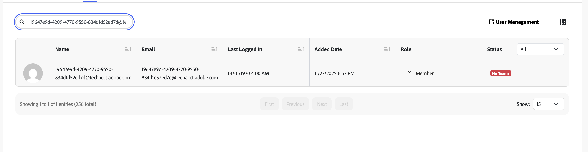

# Permissions of Technical Accounts

By default, technical accounts created from server-to-server projects are added to the Fusion organization as members with standard permissions. Without any additional configuration, the technical account user will be an **organization member** only and will not be part of any team.

## Understanding Technical Account Creation

When you create a project in Adobe Developer Console with server-to-server credentials, a Fusion user is automatically created behind the scenes. The technical account email is visible on the project's **Credentials** page in Adobe Developer Console inside **Technical Account Email** field.

For example, here the technical account user created in Fusion will have email 19647e9d-4209-4770-9550-834d1d52ed7d@techacct.adobe.com as in the screenshot.

Here is the same user inside Fusion automatically created after project creation.

## Granting Admin-Level Access to Fusion

To grant the technical account access to Fusion organization admin actions:

1. Navigate to the **Admin Console**, find the Workfront Fusion product, right organization instance and go into it's product profile.   
2. Add the technical account user as an admin within your organization. Note, the user will not exist in the Users list, even though it exists in Fusion. 

For detailed instructions, see [Add users to Adobe Workfront Fusion through the Adobe Admin Console](https://experienceleague.adobe.com/en/docs/workfront-fusion/using/set-up-and-manage-fusion/set-up-and-manage-orgs-and-teams/set-up-orgs-teams-and-users/add-fusion-users-admin-console).

**Note:** Only certain users have access to the Admin Console. If you don't have access, contact your organization administrator to configure these permissions.

**Why admin access matters:** Admin-level permissions are required for specific operations, such as viewing and exporting activity logs.

## Adding to Teams

If your technical account needs to perform operations within specific team scopes, you must explicitly add the user to those teams:

1. Open Fusion and navigate to the desired team.
2. Add the technical account user with the appropriate permissions for that team.  
